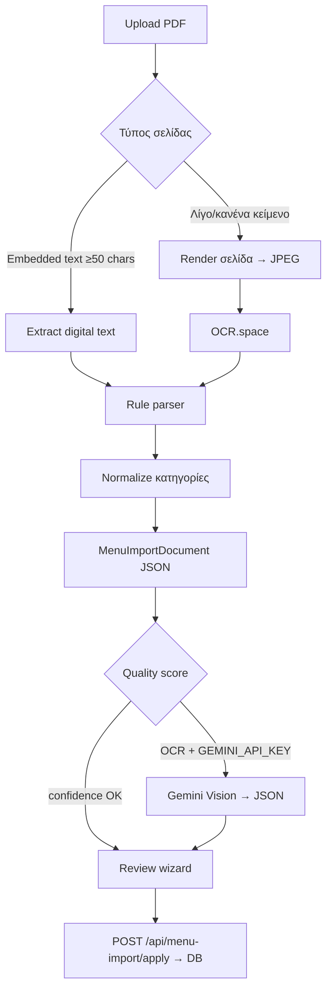

# MenuOS — Εισαγωγή καταλόγου από PDF

> **Living document** — εδώ μαζεύεται όλη η γνώση για PDF import.  
> Ενημερώνεται συνεχώς μέχρι να φτάσουμε **100% αξιόπιστη λύση** για digital + σαρωμένα μενού.  
> **Τελευταία ενημέρωση:** Ιούλιος 2026

---

## Στόχος

Ο ιδιοκτήτης ανεβάζει PDF τιμοκαταλόγου → βλέπει **αναφορά + επεξεργάσιμο προσχέδιο** → εισάγει στον κατάλογο.

**100% λύση σημαίνει:**
- Digital PDF (InDesign/Canva export): **≥95%** σωστά είδη + τιμές, ελάχιστη χειροκίνητη διόρθωση
- Σαρωμένα/photo PDF (γραφίστρια): **≥90%** είδη + τιμές, σωστές κατηγορίες, χωρίς σκουπίδια (PASTA ως προϊόν κ.λπ.)
- Bilingual (EL/EN), 2 στήλες, footnotes, εικονίδια (vegan, spicy): αναγνωρίζονται ή αγνοούνται σωστά
- **Πάντα** preview πριν import — ποτέ blind write στη βάση

---

## Τρέχουσα κατάσταση (Ιούλιος 2026)

| Στοιχείο | Κατάσταση |
|----------|-----------|
| Wizard 3 βημάτων (upload → σελίδες → review) | ✅ Live |
| Digital text extraction (`pdf-parse`) | ✅ |
| OCR για scans (`OCR.space` + render σελίδας) | ✅ |
| Hybrid routing (digital / OCR / hybrid ανά σελίδα) | ✅ |
| Rule-based parser + post-normalize κατηγοριών | ✅ |
| JSON ενδιάμεσο schema + adapters | ✅ |
| Quality score + `suggestsVision` flag | ✅ |
| Review UI (αναφορά, edit, import) | ✅ |
| Vision AI (Gemini Flash) | ✅ Pro PDF — OCR σελίδες |
| Self-hosted Tesseract service | ❌ Αντικαταστάθηκε προσωρινά από OCR.space |
| 100% αυτόματο χωρίς review | ❌ Δεν είναι στόχος |

### Benchmark: Kozas PDF (`stegnakozas-menu-25.pdf`)

Fixture στο repo: `apps/web/test-fixtures/pdf/stegnakozas-menu-25.pdf`

| Μετρική | Πριν (OCR μόνο) | Μετά hybrid+normalize (Ιούλ 2026) | Στόχος 100% |
|---------|-----------------|-------------------------------------|-------------|
| Είδη με τιμή | ~98 | ~98 | ≥95% του PDF |
| Κατηγορίες | ~38 (πολλές λάθος) | **25** (Technolocos re-import, Ιούλ 2026) | ≤15 πραγματικές |
| False positives (τίτλοι ως είδη) | Ναι (PASTA, FISH…) | Μερική βελτίωση | 0 |
| 2-στήλες layout | Χαλάει OCR | Μερική (inline split) | Vision ή layout OCR |
| Ελληνικά ονόματα (nameGr) | — | **30/83** (rules+OCR engine 3) | ≥90% |

> **Technolocos (ΚΑΦΕΝΕΣ / MENOY):** admin re-import Ιούλ 2026 — 83 είδη, 25 κατηγορίες (πριν 46). Vision off (χωρίς `GEMINI_API_KEY` στο prod).

> **Γιατί δεν φτάνουμε 100% ακόμα:** Το OCR βγάζει κείμενο γραμμή-γραμμή — δεν «βλέπει» layout, φωτό, εικονίδια, στήλες.

---

## Αρχιτεκτονική — Hybrid pipeline

Κάθε PDF **δεν θεωρείται** ότι έχει κείμενο. Κάθε σελίδα ταξινομείται ξεχωριστά.



### Διαδρομές extraction (`extraction.path`)

| Path | Πότε | Τι σημαίνει |
|------|------|-------------|
| `digital` | Όλες οι σελίδες έχουν embedded text | Γρήγορο, αξιόπιστο |
| `ocr` | Όλες οι σελίδες πέρασαν OCR | Σάρωση / photo PDF |
| `hybrid` | Μικτό (π.χ. cover + menu pages) | Συνηθισμένο |
| `vision` | Σαρωμένο PDF + Gemini Vision | Καλύτερο layout |

### Quality score

Υπολογίζεται στο `assessMenuParseQuality()`:

- **categoryToItemRatio** — πολλές κατηγορίες ανά είδος = OCR noise
- **priceLineRatio** — πόσα είδη έχουν τιμή
- **emptyCategoryCount** — κενές κατηγορίες από λάθος headers
- **confidence** 0–1
- **suggestsVision: true** — χαμηλό confidence από rules· εμφανίζεται hint + κουμπί «Ανάλυση με AI» (αν Vision ενεργό στο server)

---

## Vision AI (Gemini Flash)

**Ενεργό για Pro PDF import** όταν υπάρχει `GEMINI_API_KEY`.

| Αρχείο | Ρόλος |
|--------|--------|
| `apps/web/src/lib/pdf-vision-gemini.ts` | Gemini API + JSON parse |
| `apps/web/src/lib/pdf-import-vision.ts` | Routing OCR σελίδων → vision merge |

**Env:**

```env
GEMINI_API_KEY=           # https://aistudio.google.com/apikey (free tier — no card)
PDF_IMPORT_VISION=1       # 0 = off
PDF_IMPORT_VISION_MODE=auto  # auto (default) | ocr | always | never
GEMINI_MODEL=gemini-2.0-flash
```

**Free tier (δοκιμή):** Google AI Studio δίνει δωρεάν κλήσεις στο `gemini-2.0-flash` (~1.500/ημέρα, χωρίς κάρτα). Αρκεί για δοκιμές PDF import και λίγους πελάτες. Όταν χρειαστείς περισσότερα, ενεργοποιείς billing στο AI Studio.

**Setup:**

```bash
bash scripts/set-gemini-key.sh AIzaSy...
bash scripts/check-gemini-key.sh
# prod: APP_DIR=/opt/menuos bash scripts/set-gemini-key.sh KEY && docker compose -f docker-compose.prod.yml up -d menuos-web
```

**Routing (`PDF_IMPORT_VISION_MODE`):**
- `auto` (default) — μόνο όταν `suggestsVision` (χαμηλό rules confidence)
- `ocr` — κάθε σελίδα που πέρασε OCR → 1 κλήση Gemini
- `always` / `never` — force on/off

Στο review, αν `suggestsVision` και δεν τρέχει Vision, εμφανίζεται κουμπί **«Ανάλυση με AI»** (force retry).

Αν vision αποτύχει ή βγάλει λίγα είδη (<50% rules), **fallback** σε rules parser.

---

## JSON ενδιάμεσο schema

Κοινό format για **rules parser** και **μελλοντικό Vision**. Όχι HTML.

```json
{
  "restaurant": "",
  "languages": ["el", "en"],
  "sections": [
    {
      "title": "ΜΕΖΕΔΕΣ",
      "titleEn": "STARTERS",
      "items": [
        {
          "name": "Τζατζίκι σπιτικό",
          "nameEn": "Home made Tzatziki",
          "description": "",
          "price": 7.4,
          "icons": [],
          "notes": []
        }
      ]
    }
  ],
  "source": {
    "path": "hybrid",
    "digitalPages": 1,
    "ocrPages": 5,
    "confidence": 0.72,
    "suggestsVision": true
  }
}
```

**TypeScript:** `packages/shared/src/menu-import-document.ts`

| Συνάρτηση | Ρόλος |
|-----------|-------|
| `menuPdfParseResultToDocument()` | Parser output → JSON |
| `menuImportDocumentToParseResult()` | JSON → review wizard format |
| `assessMenuParseQuality()` | Quality metrics |

---

## Ροή χρήστη (panel)

**Route:** `/dashboard/menus/import` (Pro+)

1. **Ανέβασμα** — έως 10 PDF, 10 MB το καθένα
2. **Επιλογή σελίδων** — thumbnails, auto-skip cover/logo (πρώτη/τελευταία σελίδα αν λίγα chars)
3. **Ανάλυση** — server: extract + OCR + parse
4. **Review** — αναφορά, edit κατηγοριών/ειδών, import

**API:**
- `POST /api/menu-import/parse` — επιστρέφει categories, stats, `extraction`, `document`
- `POST /api/menu-import/apply` — γράφει επιλεγμένα στη βάση

**Copy panel:** `apps/web/src/content/dashboard-el.ts` → `importWizard`

---

## Αρχεία codebase

| Περιοχή | Αρχείο | Τι κάνει |
|---------|--------|----------|
| **Schema** | `packages/shared/src/menu-import-document.ts` | JSON types + adapters |
| **Quality** | `packages/shared/src/menu-pdf-parse-quality.ts` | Confidence / suggestsVision |
| **Parser** | `packages/shared/src/menu-pdf-parser.ts` | Regex, heuristics, normalize κατηγοριών |
| **Pipeline** | `apps/web/src/lib/pdf-import-pipeline.ts` | Orchestration μετά extract |
| **Extract** | `apps/web/src/lib/pdf-extract.ts` | pdf-parse + page selection |
| **OCR** | `apps/web/src/lib/ocr-space.ts` | OCR.space API |
| **Render** | `apps/web/src/lib/pdf-page-render.ts` | PDF page → JPEG για OCR |
| **Classify** | `apps/web/src/lib/pdf-import-page-classify.ts` | digital / scan / cover |
| **Preview** | `apps/web/src/lib/pdf-page-preview.ts` | Thumbnails στο wizard |
| **Wizard UI** | `apps/web/src/components/dashboard/menu-import-wizard.tsx` | 3-step flow |
| **Review** | `apps/web/src/lib/menu-import-review.ts` | Issues, normalize draft |
| **API parse** | `apps/web/src/app/api/menu-import/parse/route.ts` | |
| **API apply** | `apps/web/src/app/api/menu-import/apply/route.ts` | |
| **Tests parser** | `packages/shared/src/menu-pdf-parser.test.ts` | |
| **Tests schema** | `packages/shared/src/menu-import-document.test.ts` | |
| **Fixture text** | `packages/shared/src/menu-pdf-parser.kozas.fixture.txt` | Unit test snippet |
| **Fixture PDF** | `apps/web/test-fixtures/pdf/stegnakozas-menu-25.pdf` | Integration benchmark |
| **CLI simulate** | `apps/web/scripts/simulate-pdf-import.ts` | `npm run test:pdf-import` |
| **Admin import** | `apps/web/scripts/admin-import-customer-menu.ts` | Server-side bulk |

---

## Environment

```env
# Υποχρεωτικό για σαρωμένα PDF
OCR_SPACE_API_KEY=

# Προαιρετικά (defaults στο ocr-space.ts: engine 3, language gre)
# OCR_SPACE_ENGINE=3          # 3 = ελληνικά. Engine 2 δεν δέχεται gre — μόνο auto
# OCR_SPACE_LANGUAGE=gre      # ή auto (engine 2/3)
# OCR_SPACE_IS_TABLE=false    # true χαλάει bilingual 2-column
# OCR_SPACE_API_URL=          # override endpoint
```

**Production:** keys στο `/opt/menuos/.env` — deploy μέσω GitHub Actions.

---

## Parser — τι ξέρει σήμερα

### Εξαγωγή τιμών
Patterns: `12,50€`, `12.00 €`, tabs, dots leader, `—` separator, price-only γραμμές (pairing με όνομα από προηγούμενη γραμμή).

### Κατηγορίες (heuristics)
- ALL CAPS headers (EL/EN)
- Bilingual `ΣΟΥΠΕΣ / SOUPS`
- Title case sections
- `Όνομα:` με colon

### Post-normalize (Ιούλ 2026)
- Αφαίρεση κενών orphan English headers (PASTA, FISH…)
- Merge διπλών κατηγοριών (ίδιο nameGr ή nameEn match)
- Skip redundant EN header αν η τρέχουσα κατηγορία έχει ήδη το ίδιο nameEn

### Τι skip-άρει
- Cover, page numbers, URLs
- Notes: «Choice of…», «Please let us know…», seasonality
- All-inclusive headers χωρίς τιμές

### Τι ΔΕΝ κάνει
- Layout / columns / tables (visual)
- Εικονίδια (🌶 vegan, gluten free)
- Φωτογραφίες πιάτων από PDF
- Footnotes / αστερίσκοι / υποσημειώσεις με αριθμούς
- Αυτόματη μετάφραση DE/FR (μόνο αν υπάρχει στο PDF)

---

## Roadmap προς 100%

### Φάση A — OCR + rules (τώρα) ✅ μερικώς
- [x] Hybrid digital + OCR
- [x] JSON schema
- [x] Category normalize
- [x] Quality score
- [ ] Benchmark suite (5 PDFs: digital, hotel drinks, Kozas, 2-column, all-inclusive)
- [ ] Parser: block pairing για OCR price columns
- [ ] Parser: merge split bilingual items on same line
- [ ] Self-hosted Tesseract POC (αν OCR.space ceiling)

### Φάση B — Layout-aware OCR (χωρίς LLM)
- [ ] Render 300–400 DPI (τώρα ~2200px JPEG)
- [ ] Column detection (blocks/bboxes)
- [ ] Table mode selective (μόνο όπου βοηθάει)

### Φάση C — Vision AI (Pro PDF) ✅ Gemini Flash
- [x] Policy: Vision **μόνο** PDF import (Pro), όχι γενικό AI
- [x] Gemini Flash vision → JSON schema
- [x] Routing OCR pages (`PDF_IMPORT_VISION_MODE=ocr`)
- [x] Fallback σε rules αν vision αποτύχει
- [ ] Benchmark Kozas με vision vs rules (metrics στο changelog)
- [ ] Qwen2.5-VL self-hosted (optional future)

### Φάση D — Production hardening
- [ ] Metrics στο prod (parse success rate, avg edit count)
- [ ] Customer feedback loop μετά import
- [ ] Re-import diff (update vs replace)

---

## Πολιτική AI

**Ισχύει από Ιούλιο 2026:**

| Επιτρέπεται | Απαγορεύεται |
|-------------|--------------|
| Gemini Vision **μόνο** PDF import (Pro) | Chatbot, AI suggestions |
| OCR.space + rules parser | Auto-publish χωρίς review |
| MyMemory / DeepL μετάφραση πεδίων | AI-generated marketing copy |

> Vision βλέπει εικόνα σελίδας → JSON → **υποχρεωτικό review** πριν import.

---

## Testing & debugging

### Γρήγορη δοκιμή (CLI)

```bash
# Από root monorepo — χρειάζεται OCR_SPACE_API_KEY στο .env
npm run test:pdf-import -w @menuos/web

# Άλλο PDF
npm run test:pdf-import -w @menuos/web -- path/to/menu.pdf
```

### Unit tests

```bash
npm run test -w @menuos/shared -- menu-pdf-parser
npm run test -w @menuos/shared -- menu-import-document
```

### Checklist πριν deploy αλλαγών parser

1. Kozas fixture tests pass
2. Beverage/hotel fixture pass (no prices)
3. `npm run build -w @menuos/web`
4. Manual wizard test: digital PDF + scanned PDF
5. Ενημέρωση **Changelog** παρακάτω

### Συχνά προβλήματα

| Σύμπτωμα | Αιτία | Λύση |
|----------|-------|------|
| «Δεν βρέθηκε κείμενο» | Scan χωρίς OCR key | `OCR_SPACE_API_KEY` |
| `E201: language invalid` | `gre` σε Engine 2 (δεν υποστηρίζεται) | Engine **3** + `gre`, ή Engine 2 + `auto` |
| 0 είδη | Μόνο cover επιλέχθηκε | Advanced → επίλεξε menu pages |
| Πολλές κενές κατηγορίες | OCR noise | Normalize (ή Vision) |
| Τιμές σε λάθος είδος | 2-column OCR merge | Vision / column OCR |
| Duplicate EN categories | Bilingual split | normalizeParsedMenuCategories |

---

## Πλάνο & πρόσβαση

- **Pro+** (`requirePdfImportPlan`) — Basic/Trial βλέπουν upgrade banner
- Billing gate: `/dashboard/billing?upgrade=pdf-import`

---

## Changelog (ενημερώνεται εδώ)

### 2026-07-02 — OCR engine fix + Technolocos re-import
- **Root cause:** Engine 2 δεν δέχεται `gre` — προηγούμενο fix (auto→gre) ήταν λάθος
- Default OCR engine → **3** (ελληνικά). Admin script: `OCR_SPACE_ENGINE=3`, `OCR_SPACE_LANGUAGE=gre`
- Technolocos (`fanenos@gmail.com`): **83 είδη, 25 κατηγορίες** (πριν 46) — rules+OCR, χωρίς Vision

### 2026-07-02 — Vision + hybrid production
- Gemini Flash vision path (`pdf-vision-gemini.ts`, `pdf-import-vision.ts`)
- Policy update: no general AI · Vision OK for Pro PDF import
- Staff link «Προβολή» button
- Changelog + env docs

### 2026-07-02 — Hybrid foundation
- Προστέθηκε `MenuImportDocument` JSON schema + adapters
- `pdf-import-pipeline.ts`: digital/ocr/hybrid metadata + quality score
- Parser: `normalizeParsedMenuCategories`, redundant EN header skip
- Review UI: extraction path badge + vision hint
- Αυτό το document δημιουργήθηκε ως single source of truth

### 2026-06 — OCR.space + wizard
- OCR.space integration για scans
- 3-step wizard με page preview
- Kozas PDF fixture + ~98 items benchmark
- Review report + category editor

### Planned next entry
- Benchmark table Kozas: rules vs vision
- Parser improvements για 2-column OCR fallback

---

## Σχετικά docs

- [PRODUCT.md](./PRODUCT.md) — phasing, pricing (PDF = Pro)
- [ARCHITECTURE.md](./ARCHITECTURE.md) — stack overview (δείχνει εδώ για OCR λεπτομέρειες)
- [apps/web/test-fixtures/README.md](../apps/web/test-fixtures/README.md) — fixtures

**Για agents:** Διάβασε αυτό το αρχείο πριν αλλάξεις οτιδήποτε στο PDF import. Μετά από κάθε σημαντική αλλαγή, ενημέρωσε το Changelog και τα benchmarks.
